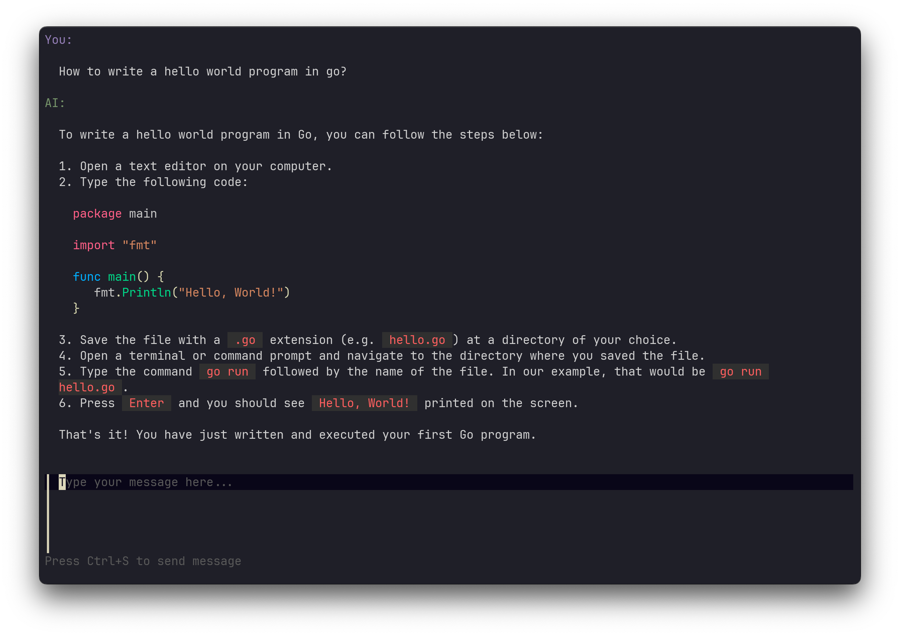

# ChatGPT TUI

## Roadmap

- [x] Basic communiation with OpenAI API
- [x] Basic Layout
- [ ] Stream API response (preventing request timeout)
- [ ] Save conversation to file
- [ ] CLI option with [cobra](https://github.com/spf13/cobra)
- [ ] configuration with [viper](https://github.com/spf13/viper)
- [ ] bubblezone mouse support
